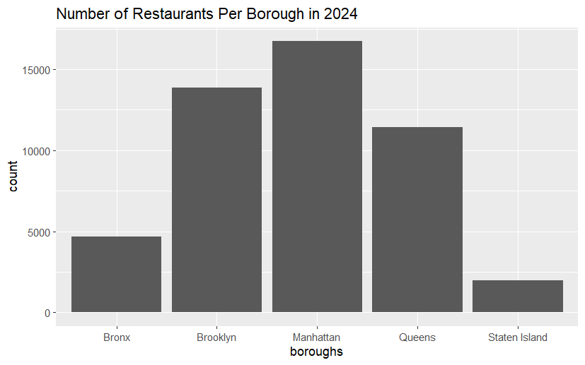
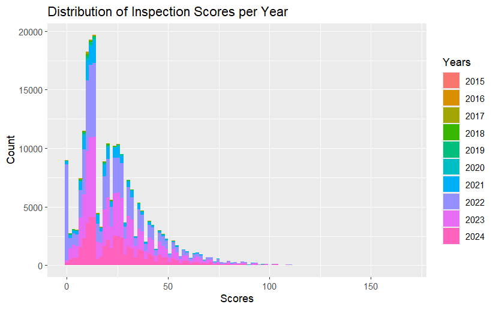
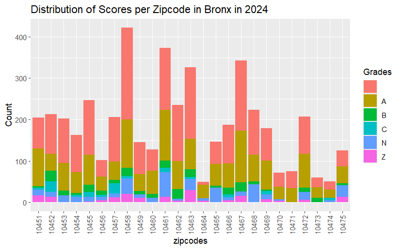

---
output:
  html_document: default
  pdf_document: default
---

# Location and Cuisine Impacts the Inspection Scores and Grades of Restaurants in New York City

Alina Mirestean

## Abstract

#### Problem

This project aims to answer if and how the different locations and cuisines of restaurants impact the final score and inspection grade received.

#### Approach

After data cleaning, the columns representing the grades, boroughs, scores, and cuisines were used from the year 2024. Chi - square tests were run between borough and grade, cuisine and grade, and cuisine and borough.

#### Results

After running the chi - square tests, the p - value between borough and grade, cuisine and grade, and cuisine and borough where all less than 0.05, so it was deemed statistically significant.

#### Conclusion

The location and cuisine of different restaurants in New York City influence the final inspection scores and grades received. This demonstrates that there might be a bias towards and against some boroughs in New York City when it comes to the inspection of restaurants.

## Background

New York City is home to hundreds of restaurants, some of areas having a greater density than others. When deciding where to eat, people usually check the ratings/scores of restaurants to make a educated choice, leading to some boroughs of NYC having a greater economic profit from restaurants. This may also lead to a bias in the range of scores received by some boroughs compared to others.

Health Department’s Restaurant Grading Guidelines provide a template to asses the restaurants in NYC. I looked into if there is a correlation between the grade received and the location of the restaurants in the city.

## Results

a.) this graph shows the different distributions of restaurants in New York City by borough. It shows that Staten Island has the least number of restaurants, while Manhattan has the most.

b\. This image shows the distribution of the Scores received by boroughs in each year from 2015 - 2024. It can be seen that the range gets larger as the years increase. There is also a larger range after the pandemic compared to before it

c\. This image shows the distribution of the scores by zip code in the Bronx. It is visible that even in zip codes with the same amount of restaurants, there is a difference in the grade distribution. This shows us that there is a variance of what grades are given based on the locations.

## Discussion

The results of the Chi - Square tests point to the conclusion that there is a correlation between the grade received and the location of restaurants in the city. From these results, it can be inferences that there is bias against some boroughs in NYC compared to others. This may influence where people choose to eat, limiting the impact of some of the economic improvements in some boroughs. People rely heavily on ratings, whichmight not always be the more accurate presentation of what is the truth and is not without bias. This does support my original hypothesis, that there is a correlation between the location and grades. There should be a more foolproof way to score restaurants created in the future.

## Code and Data Availability

The data supporting the findings of this study is available at <https://data.cityofnewyork.us/Health/DOHMH-New-York-City-Restaurant-Inspection-Results/43nn-pn8j/about_data>

Code developed in this study can be accessed at <https://github.com/the-codingschool/DSRP-2024-Jason/tree/dev-Alina>

## Acknowledgements

I would like to acknowledge The Coding School for the opportunity to learn about data science and collaborate with the Columbia University Data Science Institute: Sarah Parker for teaching me, and Jason Moon for guidance on the project.

### 
